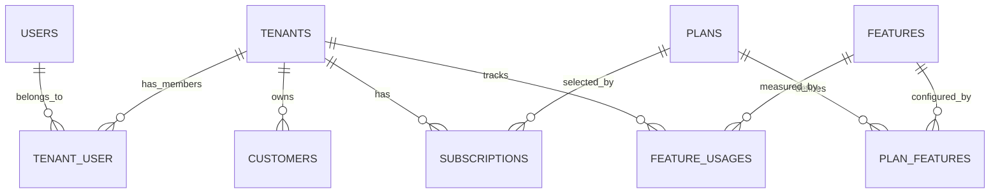

# Architecture Notes

This document explains how the API is put together and why the main technical
choices were made. It is written for a reviewer who wants to understand the
system without reading every file first.

## High-Level Shape

The application is a Laravel REST API. It does not serve a frontend. The
runtime is Docker-based:

- Nginx receives HTTP traffic on port `8000`.
- PHP-FPM runs the Laravel application.
- MySQL stores application data.
- Redis backs cache and queues.
- A separate queue container runs Redis-backed jobs.

The API is versioned under:

```text
/api/v1
```

The request flow is:

```text
client
  -> nginx
  -> Laravel route
  -> Sanctum authentication
  -> active user check
  -> token ability check
  -> tenant resolver where needed
  -> permission/team context where needed
  -> controller
  -> service
  -> model/database/cache/queue
  -> API resource/response envelope
```

## REST API Design

Routes are grouped by concern:

- `/auth/*` for login, logout, current user, and authenticated user creation.
- `/plans` for plan browsing.
- `/tenants` for tenant management.
- `/tenants/{tenant}/members` for tenant user membership.
- `/tenants/{tenant}/customers` for customer CRUD.
- `/tenants/{tenant}/subscription` for subscription management.
- `/tenants/{tenant}/dashboard` for tenant analytics.

Controllers are intentionally thin. They accept a validated request, call a
service, and return a consistent JSON envelope.

Success response:

```json
{
  "success": true,
  "message": "Request successful.",
  "data": {}
}
```

Error response:

```json
{
  "success": false,
  "message": "This action is unauthorized."
}
```

Validation responses include an `errors` object.

## Multi-Tenancy

The chosen tenancy model is:

```text
single database + shared schema + tenant_id on tenant-owned tables
```

This is the simplest model to run and review for the assessment, but it still
exercises the important part of multi-tenancy: every tenant-owned operation
must prove which tenant it belongs to.

Users are global identities. A user can belong to more than one tenant through
`tenant_user`.

Tenant-owned tables include:

- `customers`
- `subscriptions`
- `feature_usages`
- `tenant_user`

Tenant-scoped routes require `X-Tenant-ID`. The middleware resolves the tenant
from the authenticated user and stores it in a request-scoped `TenantContext`.
Services then check that the route tenant id matches the resolved context
before loading tenant-owned records.

That means a client cannot simply pass another tenant id in the URL or request
body and get data from it.

## Authorization

The system separates three questions:

1. Who is the user?
2. Which tenant is this request operating in?
3. What is the user allowed to do in that tenant?

Sanctum answers the first question. `ResolveTenant` answers the second.
Policies and Spatie Permission answer the third.

Roles use the `sanctum` guard:

- `superadmin`
- `tenant_admin`
- `manager`
- `user`

The `superadmin` role can manage the platform without normal tenant
membership. It still does not turn an unsafe tenant-scoped request into a safe
one. Routes that require tenant context still require a valid context.

Tenant admins can manage the tenant they belong to. Managers get operational
permissions. Users have read-oriented permissions.

## Subscription and Entitlement Model

Plans are reusable commercial packages. Features are individual capabilities or
limits. `plan_features` stores the value of each feature for each plan.

Example features:

- `users` as a numeric limit
- `customers` as a numeric limit
- `analytics` as a boolean feature

Subscriptions belong to tenants and preserve history. When a tenant changes
plan, the previous active subscription is cancelled and a new active
subscription is created.

The entitlement service builds the tenant's active feature snapshot from:

```text
tenant -> active subscription -> plan -> plan_features -> features
```

For numeric limits, current usage is stored in `feature_usages` for the
subscription period. Writes that consume quota run inside database
transactions and use row locking where it matters, so over-limit writes do not
partially create data.

## Database Design

Core relationship overview:



Important constraints:

- `users.email` is unique.
- `tenants.slug` is unique.
- `tenant_user(tenant_id, user_id)` is unique.
- `plan_features(plan_id, feature_id)` is unique.
- `features.key` is unique.
- `customers(tenant_id, email)` is unique when email is present.
- `feature_usages(tenant_id, feature_id, period_start, period_end)` is unique.

Delete behavior is deliberate:

- Tenant-owned records cascade when a tenant is deleted.
- Plans referenced by subscriptions are restricted from deletion.
- Features referenced by usage records are restricted from deletion.

## Query and Performance Design

The API expects tenant-scoped lists to grow, so list endpoints paginate and cap
`per_page` at `100`.

Dashboard counts are aggregate queries, not loaded collections. Customer and
member list endpoints eager-load only what they need. Request sort fields are
allow-listed to avoid unsafe or inefficient client-selected expressions.

Important indexes:

- `tenant_user(tenant_id, status)`
- `tenant_user(user_id, status)`
- `subscriptions(tenant_id, status, ends_at)`
- `subscriptions(tenant_id, status, starts_at)`
- `customers(tenant_id, status, created_at)`
- `customers(tenant_id, name, id)`
- `plans(status, price, id)`

These indexes match the actual access paths: accessible tenant lookup, member
counts, current subscription lookup, tenant customer filtering, and active plan
listing.

## Caching

Redis is used for application caching.

The app caches:

- Tenant dashboard data.
- Tenant entitlement snapshots.

Cache keys include the tenant id:

```text
tenant:{tenant_id}:dashboard:v1
tenant:{tenant_id}:features:v1
```

Default TTLs:

- Dashboard: 60 seconds.
- Entitlements: 300 seconds.

Invalidation is explicit. Tenant writes that affect dashboard or entitlement
data clear the relevant cache keys. This matters because a TTL-only approach
can return stale access or quota information for too long.

## Queues

The queue system is intentionally small. The main asynchronous operation is the
tenant admin welcome email.

When a super admin creates a tenant:

1. The tenant is created.
2. The initial tenant admin user is created from the tenant name and email.
3. The user is attached to the tenant as `tenant_admin`.
4. A welcome email job is dispatched after commit.

The job carries explicit tenant and user ids, validates the membership again
when it runs, re-establishes tenant context, sends the email, and forgets the
context afterward.

The queue worker runs in Docker:

```bash
php artisan queue:work redis --queue=notifications,default --sleep=1 --tries=3 --backoff=10 --timeout=90
```

Laravel's failed job table is enabled through database-backed failed jobs.

## Security

The main security choices are boring on purpose:

- `.env` stays out of Git.
- `APP_DEBUG=false` is the safe default.
- API exceptions are normalized and do not expose stack traces.
- Unexpected server exceptions are logged.
- Login has a dedicated rate limiter.
- General API routes have token-aware rate limiting.
- Tokens require the `api` ability.
- Inactive users cannot continue using old tokens.
- Validation is handled through Form Requests.
- Output is controlled through API Resources.
- Tenant ids from the client are always checked against authenticated access.
- Cross-tenant resource ids are resolved through the tenant boundary first.

## Trade-Offs

Single database tenancy:

This is easier to run in an assessment and keeps reporting/querying simpler.
The trade-off is that every query and cache key must be disciplined about
tenant isolation.

Global users:

Users are login identities, not tenant-owned records. This supports one person
belonging to multiple tenants. The trade-off is that membership status and role
context must be checked per tenant.

Customer table separate from users:

Customers are business contacts. Users are authenticated actors. Keeping them
separate avoids forcing every customer to have login credentials. If a real
product needed customer login later, it could add a deliberate link between a
customer and a user.

Services over repositories:

The project uses services for workflows and transactions. It does not wrap
simple Eloquent queries in repositories unless a real boundary would help.
That keeps the code easier to explain in an interview.

Caching only where useful:

The dashboard and entitlement snapshots are cached because they are reused and
aggregate multiple pieces of tenant data. CRUD list endpoints are not cached
because pagination, filters, permissions, and frequent changes make correctness
more important than a small cache win.

Temporary tenant admin password:

The current implementation uses the configured temporary password for the
initial tenant admin. In production this should become a password setup or
reset flow, but the temporary password keeps the assessment flow simple and
testable.

## Where to Look in the Code

- Routes: `routes/api.php`
- API response trait: `app/Http/Concerns/ApiResponse.php`
- Tenant middleware: `app/Http/Middleware/ResolveTenant.php`
- Tenant context: `app/Tenancy/TenantContext.php`
- Tenant resolver: `app/Tenancy/TenantResolver.php`
- Services: `app/Services`
- Policies: `app/Policies`
- Feature limits: `app/Services/EntitlementService.php`
- Caching: `app/Services/TenantCacheService.php`
- Queue job: `app/Jobs/SendTenantAdminWelcomeEmail.php`
- API tests: `tests/Feature`
